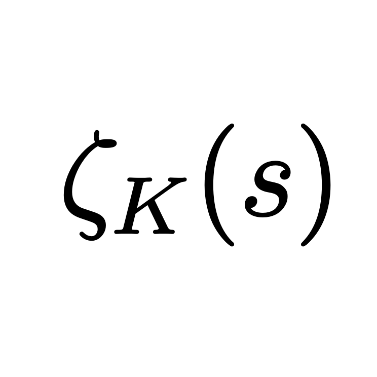

<h1 align="center">Dedekind: An AlgNT Library for Rust </img></h1>

`dedekind` is hoping to be a general-purpose library for abstract and number
theoretic functions in Rust.

## Motivation

This project was born out of work on Project Euler problems and other problems
in number theory and algebra for my blog. There's a lot of super common
algorithms in number theory, and it's great to have a playground to not
only be able to work with CAS features, but also tweak them for my custom needs
(for example, polynomials over finite fields and custom algorithm
implementations) and still have performant features. I hope the library fares
useful for others as well!

## Coverage/Features

Here's a roadmap of features that are planned/in the works:

**Elementary Number Theory:**

- Prime factorizations
- Sieves
- Elementary functions (Euler totient, Legendre symbols, modular powers)
- Factorization algorithms
- Specific Diophantine solutions modulo primes (Tonelli-Shanks, roots of unity)

**Analytic Number Theory:**

- Special functions (Riemann zeta, Dedekind zeta, Chebyshev, etc.)

**Algebra:**

- Univariate polynomials (efficient implementations!)
- Finite fields (at the very least for prime order)
- Quotient rings
- Cyclotomic polynomials
- Cyclotomic integers
- Univariate ideals

Here's a list of things that are *not* in the scope of the project:

- Big integers (there are many libraries for this!)
- Elliptic curves (at least not in the full extent, as it requires much data)
- Classification of groups (same as above)
